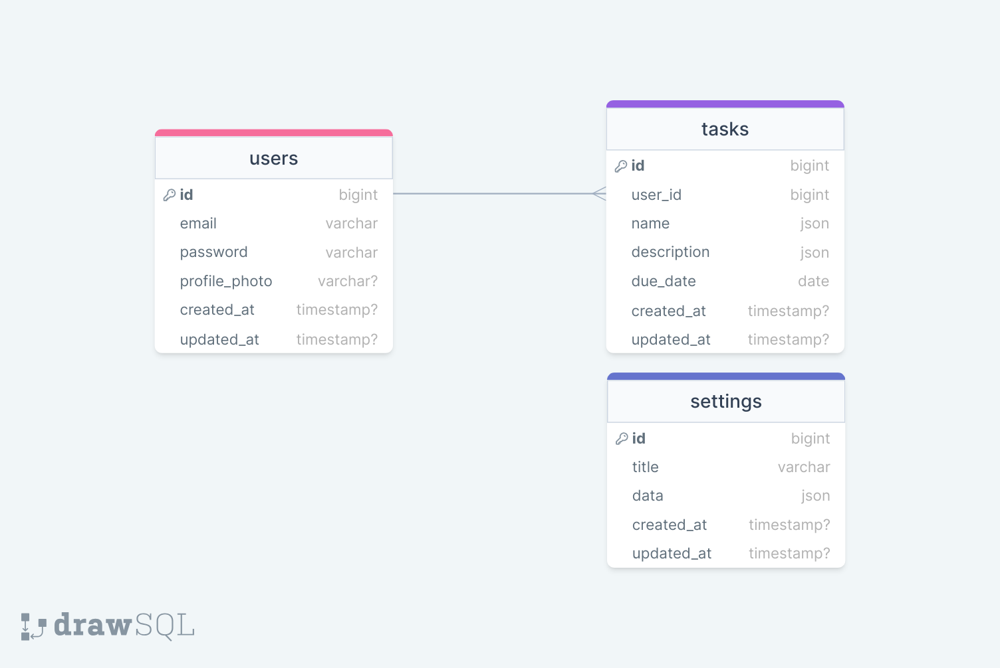

# Task Manager

---

Task Manager is a platform which gives you opportunity to manage your tasks. Via app, you can add, delete, edit personal tasks, see due date for each one etc...

---

### Table of Contents
* [Prerequisites](#prerequisites)
* [Tech Stack](#tech-stack)
* [Getting Started](#getting-started)
* [Migrations](#migration)
* [Development](#development)
* [Usage](#usage)
* [Resources](#resources)

### Prerequisites
*  *PHP@8.1*
*  *MYSQL@8 and up*
*  *npm@10 and up*
*  *composer@2 and up*

### Tech Stack
*  [Laravel@10.x](https://laravel.com/docs/10.x) - back-end framework
*  [Spatie Translatable](https://github.com/spatie/laravel-translatable) - package for translation
*  [Tailwind CSS](https://github.com/tailwindlabs/tailwindcss) - CSS framework

### Getting Started
1. First of all you need to clone Task Manager repository from GitHub:
```sh
git clone https://github.com/RedberryInternship/task-manager-luka-jikia
```

2. Next step requires you to run *composer install* in order to install all the dependencies.
```sh
composer install
```

3. After you have installed all the PHP dependencies, it's time to install all the JS dependencies:
```sh
npm install
```

4. Now we need to set our **.env** file. Go to the root of your project and execute this command.
```sh
cp .env.example .env
```

And now you should provide **.env** file all the necessary environment variables:

**MYSQL:**
>DB_CONNECTION=mysql

>DB_HOST=127.0.0.1

>DB_PORT=3306

>DB_DATABASE=*****

>DB_USERNAME=*****

>DB_PASSWORD=*****

**Storage:**
>FILESYSTEM_DISK=public

After setting up **.env** file, in the root of you project  execute:
```sh
php artisan key:generate
```
which generates auth key.

To make files publicly accessible execute:
```sh
php artisan storage:link
```

You may additionally need to change default filesystem disk in ***filesystems.php***:
>'default' => env('FILESYSTEM_DISK', 'public'),

##### Now, you should be good to go!

### Migration
If you've completed getting started section, then migrating database if fairly simple process, just execute:
```sh
php artisan migrate
```

### Development
You can run built-in Laravel development server by executing:
```sh
php artisan serve
```

And run Vite's server for frontend by executing:
```sh
npm run dev
```

### Usage
In order to use app you must create user via artisan console by running command:
```sh 
php artisan task-manager:create-user
```

### Resources
* **Database Design Diagram** 
* [Figma Design](https://www.figma.com/file/HkL8NHL7914PBgdYb6D3zN/Laravel-Dev?type=design&node-id=0-1&mode=design&t=PcfFZjW8iAKz044P-0)
